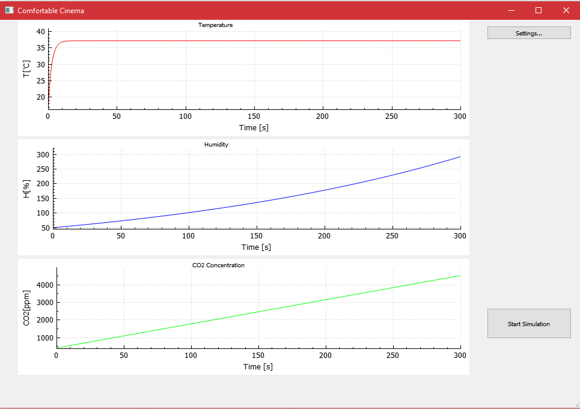
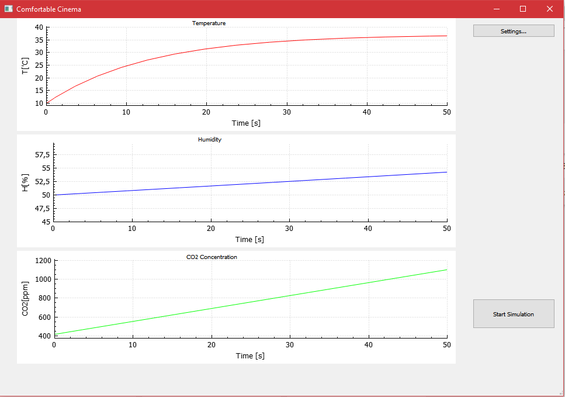

# ZTPR
Simulation of vent and A/C in cinema, made in C++, with Qt, STL and Boost libraries. 

Project made during Advanced Programming Techniques subject, during Warsaw University of Technology studies.

